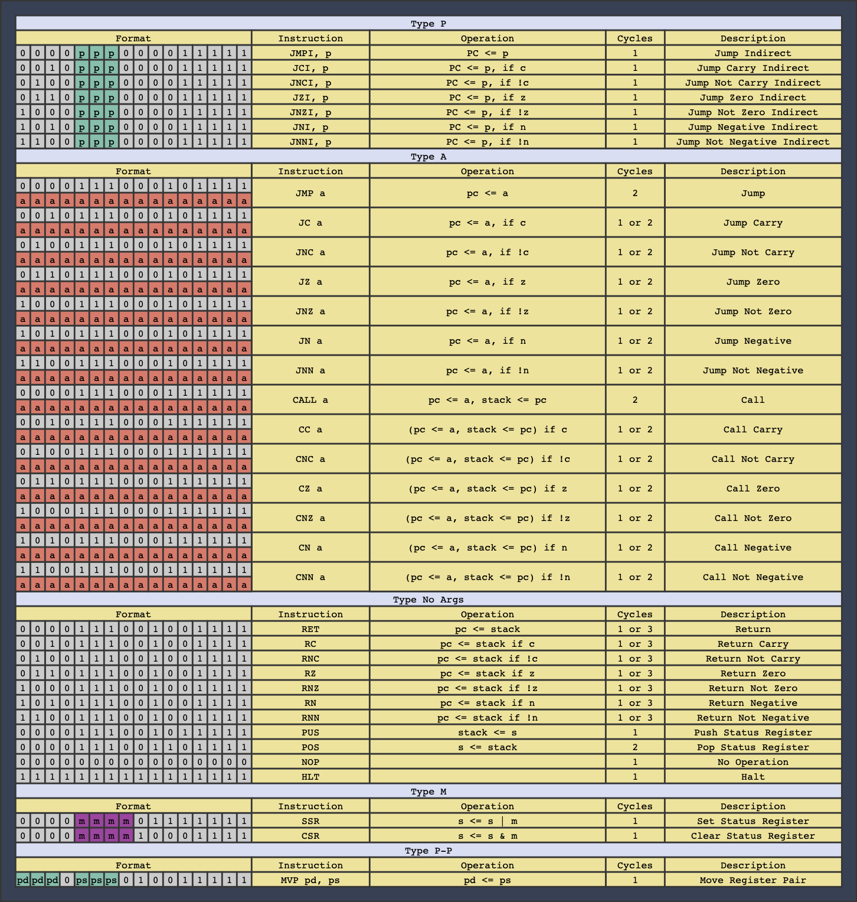

# Pet On A Chip
Pet on a chip is a project which aims to condense the control logic the robot described in Frank DaCosta's book "How to Build Your Own Working Robot Pet" onto a single chip. This will be done by utilizing the tinySoC project by implementing all control onto an FPGA.

## tinySoC
tinySoC is a small system on a chip consisting of an 8-bit CPU, an 80 column VGA graphics card, GPIO and counter/timer peripherals, and a UART, all implemented on an ice40 FPGA. It also comes with an assembler and utilities for loading programs into the internal block memory without having to rerun synthesis and place-and-route.

## The CPU

The CPU is an 8-bit RISC core, with a Harvard architecture. It has a 16-bit wide instruction memory, an 8-bit wide data memory, and both have a 16-bit address. The CPU has 16 general purpose 8-bit registers along with a 4-bit status register. The processor is not fully pipelined, but does fetch the next instruction while executing the current one. Most instructions execute in a single clock cycle, but a few take two or three.

## The GPU

The GPU operates in a monochrome 80 column text mode, and outputs a VGA signal at a resolution of 640 by 480 at 60 frames per second. The GPU contains an ASCII buffer which the user can write to in order to display messages on the screen. A control register allows the user to set the text to one of 7 colors, and to enable an interrupt to the CPU which fires every time a frame finishes and enters the blanking period.

## The Instruction Set



## The PCBs
The main board:

The expantion board:

## The Assembler

The assembler is case insensitive.

### Comments
Comments begin with semicolons.
```assembly
        .code
        ldi r0, 1 ; This is a comment
```

### Constants
Constants are in decimal by default, but hexadecimal and binary are also supported. Constants can also be negative and are stored in two's complement form when assembled.
```assembly
        .code
        ldi r0, 10     ; Decimal constant
        ldi r0, 0x0A   ; Hexadecimal constant
        ldi r0, 0b1010 ; Binary constant
        ldi r0, -10    ; A negative constant
```

### Label Definitions
Label definitions may be any string ending with a colon, as long as the string is not in the form of a constant or is one of the reserved keywords

```assembly
        .code
        ldi r0, 10
loop:   adi r0, -1
        bnz loop
        hlt
```

### Directives

#### .org
Sets the origin to the given address. Only forward movement of the origin is permitted.
```assembly
        .code
        ldi r0, 1
        out r0, 0
        br foo
        
        .org 0x0B
foo:    out r0, 1
        hlt

;*************************************************************************
; Assembles to the following:
; Address        Label          Code                     Source
; ------------------------------------------------------------------------
; 0x0000                        0b0000000000010001       LDI R0, 1        
; 0x0001                        0b0000000000001001       OUT R0, 0        
; 0x0002                        0b0000000010011110       BR FOO           
; 0x000B         FOO:           0b0000000000011001       OUT R0, 1        
; 0x000C                        0b1111111111111111       HLT 
```

#### .db
Writes one or more data bytes sequentially into data memory.
```assembly
        .data
        .db 0x01, 0x44, 0x73

;*************************************************************************
; Assembles to the following:
; Address        Label          Data
; ------------------------------------------
; 0x0000                        0x01
; 0x0001                        0x44
; 0x0002                        0x73
```

#### .string
Writes a null terminated ASCII string into data memory. Double quotes and backslashes must be escaped with a backslash.

```assembly
        .data
        .string "The robot says \"Hi!\""
        
;*************************************************************************
; Assembles to the following:
; Address        Label          Data
; ------------------------------------------
; 0x0000                        0x54
; 0x0001                        0x68
; 0x0002                        0x65
; 0x0003                        0x20
; 0x0004                        0x72
; 0x0005                        0x6F
; 0x0006                        0x62
; 0x0007                        0x6F
; 0x0008                        0x74
; 0x0009                        0x20
; 0x000A                        0x73
; 0x000B                        0x61
; 0x000C                        0x79
; 0x000D                        0x73
; 0x000E                        0x20
; 0x000F                        0x22
; 0x0010                        0x48
; 0x0011                        0x69
; 0x0012                        0x21
; 0x0013                        0x22
; 0x0014                        0x00
```

#### .ostring
Write a ASCII string into data memory. The string is open, which means that it is not null terminated. This is useful if you have a long string that you want to split up into multiple lines in the assembly source file.

```assembly
        .data
        .ostring "Hi! "
        .string  "Bye!"

;*************************************************************************
; Assembles to the following:
; Address        Label          Data
; ------------------------------------------
; 0x0000                        0x48
; 0x0001                        0x69
; 0x0002                        0x21
; 0x0003                        0x20
; 0x0004                        0x42
; 0x0005                        0x79
; 0x0006                        0x65
; 0x0007                        0x21
; 0x0008                        0x00
```

#### .define
Equates a symbol with a number.
```assembly
        .code
        .define foo, 5
        ldi r0, foo
        hlt
        
;*************************************************************************
; Assembles to the following:        
; Address        Label          Code                     Source
; ------------------------------------------------------------------------
; 0x0000                        0b0000000001010001       LDI R0, FOO     
; 0x0001                        0b0000000011110000       HLT  
```

### Expressions
Anytime an instruction or directive requires a numerical argument, an expression can be used.
Supported operations inside expressions include addition and subtraction. The location counter $ is also made available. If an instruction is two bytes long then $ refers to the address of the second byte. Expressions may contain symbols, but must resolve within two passes of the assembler, and if used for directive arguments, must resolve in a single pass.

```assembly
; Example resolution in one pass
        .code
        .define foo, 5
        ldi r0, foo + 7
        hlt

;*************************************************************************
; Assembles to the following:
; Address        Label          Code                     Source
; ------------------------------------------------------------------------
; 0x0000                        0b0000000011000001       LDI R0, FOO + 7
; 0x0001                        0b0000000011110000       HLT
```
```assembly
; Example resolution in two passes
        .code
        ldi r0, foo + 7
        hlt
        .define foo, 5

;*************************************************************************
; Address        Label          Code                     Source
; Assembles to the following:
; ------------------------------------------------------------------------
; 0x0000                        0b0000000011000001       LDI R0, FOO + 7
; 0x0001                        0b0000000011110000       HLT
```
```assembly
; Example resolution in two passes with $
        .code
        ldi r0, $
        jmp $ + foo
        .define foo, 2
        nop
        nop
        nop
        hlt

;*************************************************************************
; Assembles to the following:
; Address        Label          Code                     Source
; ------------------------------------------------------------------------
; 0x0000                        0b0000000000000001       LDI R0, $
; 0x0001                        0b0000000010111000       JMP $ + FOO
; 0x0002                        0b0000000000000100
; 0x0003                        0b0000000000000000       NOP
; 0x0004                        0b0000000000000000       NOP
; 0x0005                        0b0000000000000000       NOP
; 0x0006                        0b0000000011110000       HLT
```
## The Development Process
To perform synthesis and place-and-route, run:
```bash
make synth
make pnr
```
To assemble a demo program, run:
```bash
./assemble programs/shell.asm
```
To upload the configuration bitstream for the previously assembled program, run:
```bash
./upload shell
```
## Requierments
- Yosys for synthisis
- nextpnr for place and route
- icestorm tools for icebram and iceprog
